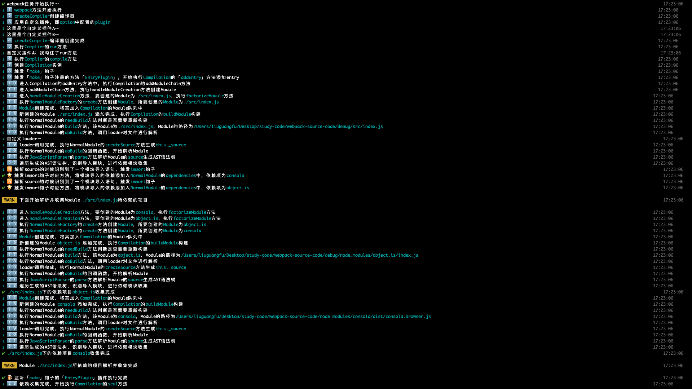
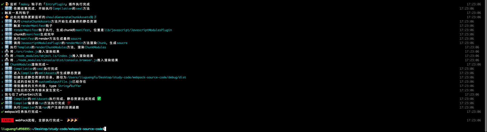

# webpack-source-code

webpack源码解析，版本为`5.0.0-beta.7`

通过控制台log，分析整体流程，如下





# 流程解读

## webpack启动

webpack有两种启动方式

1. 命令行

`webpack ./debug/index.js --config ./debug/webpack.config.js`

2. 脚本

`require(webpack')(webpackConf, callback)`

其实第一种最终也会用`require`的方式来启动webpack，具体在`./bin/webpack.js`文件

使用`require`的方式也有两种写法，如果执行`webpack`函数，只传递了webpackConf参数，webpack会返回一个`compiler`，顾名思义，`compiler`就是webpack的编译器了，整个编译过程都由`compiler`完成，`compiler`具有一个人`run`方法，执行`run`方法才会启动编译器的编译过程。

所以只传递一个webpackConf参数的时候，需要手动执行`compiler`的`run`方法。

webpack方法的第二个参数是一个回调函数，webpack编译成功、失败后都会执行该回调函数，并返回相应的状态，如果存在该回调函数，webpack方法内部会自动调用`compiler`的`run`方法，启动编译器的编译过程。

代码如下

```
// 下面是手动执行run方法
const compiler = webpack(config)
compiler.run((err, stats) => {
	if (err) {
		return consola.fatal(err)
	}

 consola.success('webpack任务执行完成～')
})

// 如果传入回调函数会自动执行compiler的run方法进行编译
webpack(config, (err, stats) => {
	if (err) {
		return consola.fatal(err)
	}

	console.log('webpack任务执行完成～')
})
```

## webpack编译起点

### webpack方法

那我们进入webpack方法内看一看，源码如下

```
const webpack = (options, callback) => {
	consola.info('1⃣️  `webpack`方法开始执行')
	// 对传入的options进行模式化校验
	validateSchema(webpackOptionsSchema, options);

	let compiler;
	let watch = false;
	let watchOptions;

	// 多个配置对象
	// 传入的配置是个数组，那么数组内的所有配置都会构建，暂时先不研究
	if (Array.isArray(options)) {
		compiler = createMultiCompiler(options);
		watch = options.some(options => options.watch);
		watchOptions = options.map(options => options.watchOptions || {});
	}
	else {
		compiler = createCompiler(options);
		watch = options.watch; // 配置的watch，监听文件变动，实时进行打包
		watchOptions = options.watchOptions || {}; // watchOptions 参考文档
	}

	// 如果传入了回调，自动执行run方法，否则需要手动执行run进行打包
	if (callback) {
		if (watch) {
			compiler.watch(watchOptions, callback);
		}
		else {
			compiler.run((err, stats) => {
				compiler.close(err2 => {
					consola.info('3⃣️ 8⃣️  执行`Compiler`方法`run`用户注册的回调函数')
					callback(err || err2, stats);
					consola.fatal('webPack流程，全部执行完成～  🎉🎉🎉')
				});
			});
		}
	}

	// 返回一个compiler实例
	return compiler;
};
```

进入webpack方法的第一步，就是对传入的`options`进行schema校验，也就是常用的`webpack.config.js`中的配置。这里用到了webpack的一个工具库`schema-utils`，该工具库内部使用了`ajv`对传入的`options`进行schema校验。

然后会针对多个配置对象的的判断，如果存在多个配置对象，那么所有的配置对象都会构建，这里先不研究，使用场景见[文档](https://www.webpackjs.com/configuration/configuration-types/#%E5%AF%BC%E5%87%BA%E5%A4%9A%E4%B8%AA%E9%85%8D%E7%BD%AE%E5%AF%B9%E8%B1%A1)。

接下来就是通过`createCompiler(options)`来创建编译器了，我们下一小结分析`createCompiler`的逻辑。

前面说过，创建完编译器`compiler`，如果存在webpack回调函数，会自动执行编译器的编译操作也就是`compiler`的`run`方法。

如果配置了`watch`的话，会调用`compiler`的`watch`方法，监听任何编译器已解析文件的更改，本质就是监听到文件改动执行`run`方法。

最后webpack方法将编译器`compiler`返回，以便与开发者使用`compiler`进行其他操作。

### createCompiler

`createCompiler`源码如下

```
const createCompiler = options => {
	consola.info('2⃣️  `createCompiler`创建编译器')

	// 根据默认配置和传入的配置生成最终的配置
	options = new WebpackOptionsDefaulter().process(options);

	const compiler = new Compiler(options.context);
	compiler.options = options;

	new NodeEnvironmentPlugin({
		infrastructureLogging: options.infrastructureLogging
	}).apply(compiler);

	// 遍历plugin数组，应用插件
	if (Array.isArray(options.plugins)) {
		consola.info('3⃣️  应用自定义插件，即`option`中配置的`plugin`')

		for (const plugin of options.plugins) {
			// plugin的第一种写法，直接是个函数，接收的参数是compiler实例
			if (typeof plugin === "function") {
				plugin.call(compiler, compiler);
			}
			// plugin的第二种写法，是个对象，对象拥有apply方法，接收的参数是compiler实例
			else {
				plugin.apply(compiler);
			}
		}
	}

	// 引入Tapable概念
	compiler.hooks.environment.call();
	compiler.hooks.afterEnvironment.call();

	// 处理传入的options
	// 根据options应用超级多内置插件，插件是webpack功能强大之处
	// webpack插件其实就是一个提供apply方法的类，它在合适的时候会被webpack实例化并执行apply方法
	// 而apply方法接收了 compiler 对象，方便在hooks上监听消息
	consola.info(`应用内置插件`)
	compiler.options = new WebpackOptionsApply().process(options, compiler);
	// process函数执行完，webpack将所有它关心的hook消息都注册完成，等待后续编译过程中挨个触发

	consola.info('4⃣️  `createCompiler`编译器创建完成')
	return compiler;
};
```
